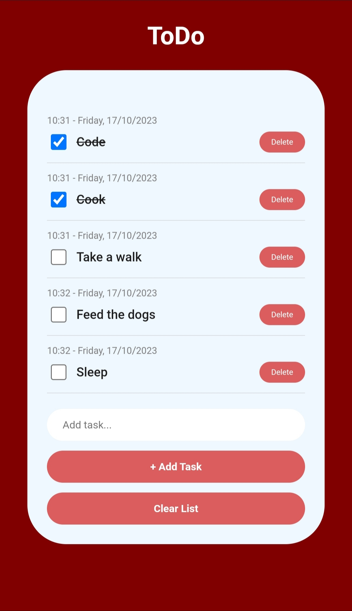

# Beginner Web-development Project - Todo

This is a beginner ToDo list project.

## Table of contents

- [Overview](#overview)
  - [The challenge](#the-challenge)
  - [Screenshot](#screenshot)
  - [Links](#links)
  - [Built with](#built-with)
  - [What I learned](#what-i-learned)
- [Author](#author)

## Overview
  This project focuses on creating a Todo list web application. It involves implementing features to persistently store list items on the device's local storage, ensuring they remain intact even after the page is refreshed.

### The challenge
Users should be able to:

- Add items to the list
- Tick items completed from the list
- Delete individual list item
- Clear the whole list

### Screenshot

### Links

- Solution URL: [View Project](https://sh4vii.github.io/ToDo/)

### Built with

- Semantic HTML5 markup
- CSS custom properties
- Flexbox
- Desktop-first workflow
- Javascrip

### What I learned

- How to store data in local storage

## Author

- Name: Shavii

